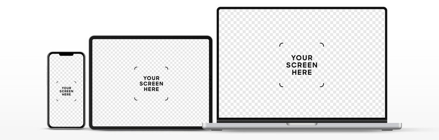

<p align="center">
    <a href="" rel="noopener">
    </a>
</p>

<h3 align="center">Quiz-Android</h3>

<div align="center">

  [](https://github.com/courierofcode/Templates/)
  [](https://github.com/courierofcode/Templates/issues)
  [](https://github.com/courierofcode/Templates/blob/main/LICENSE)
</div>

---


## 📝 Table of Contents
- [About](#about)
- [Getting Started](#getting_started)
- [Usage](#usage)
- [Deployment](#deployment)
- [Built Using](#built_using)

## 🧐 About <a name = "about"></a>
TemplateAbout

## 🏁 Getting Started <a name = "getting_started"></a>
These instructions layout the process guiding design process from conception to deployment. See [deployment](#deployment) for notes on how to deploy the project on a live system.
### Design
---
#### Tools
[](https://www.google.com)

#### Features
- [ ] Signup & Login
- [ ] User Stories


#### Concept (Wireframes)
<p align="center">
    <a href="" rel="noopener">
    </a>
</p>

#### Concept (Mockups)
<p align="center">
    <a href="" rel="noopener">
    </a>
</p>

#### Concept (Demo)
<p align="center">
    <a href="" rel="noopener">
    </a>
</p>

---
## 🎈 Usage <a name="usage"></a>
* Install ...
TemplateUsage. These instructions will get a copy of the project up and running on your local machine for development and testing purposes.

```shell
    Process...
```
## 🚀 Deployment <a name = "deployment"></a>
- Source Hosted by GitHub
- Cloud computing provider AWS/GCP/Azure...


## ⛏️ Built Using <a name = "built_using"></a>
[](https://www.rust-lang.org/)
[](https://aws.amazon.com/)